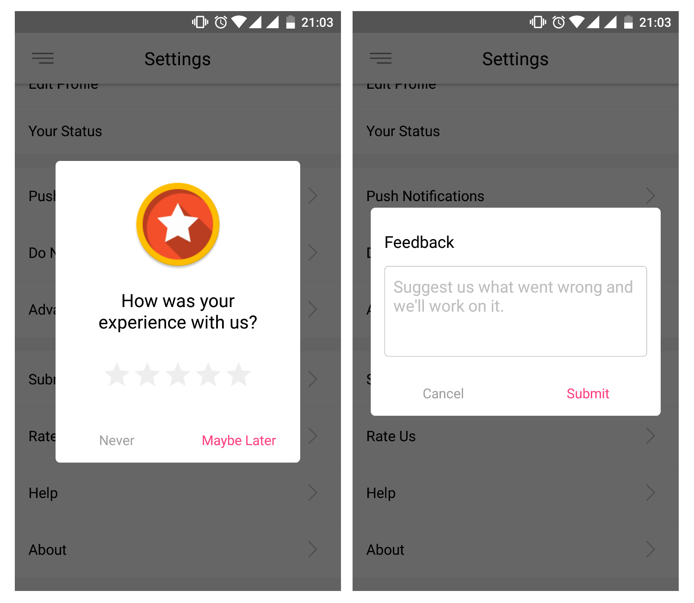

# Smart App Rate

Smart app rate dialog for Android which takes user rating into consideration. If the user rates the app below the defined threshold rating, the dialog will change into a feedback form. Otherwise, It
will take the user to the Google PlayStore.



## Features

- Auto fetches the app icon to appear on top of the dialog
- Make the dialog appear on a defined app session
- Opens Feedback form if the user rates below the minimum threshold
- Extracts the accent color from your app's theme
- Customizable title, positive button and negative button texts
- Customizable button colors and backgrounds
- Override dialog redirection to Google Play or Feedback form according to your needs

If you want the dialog to appear on the Nth session of the app, just add the `session(N)` to the dialog builder method and move the code to the `onCreate()` method of your Activity class. The dialog
will appear when the app is opened for the Nth time.

## How to use

Use the dialog as it is

```kotlin

val ratingDialog: RatingDialog = RatingDialog.Builder(this)
    .threshold(3)
    .session(1)
    .onRatingBarFormSubmit { feedback -> Log.i(TAG, "onRatingBarFormSubmit: $feedback") }
    .build()

ratingDialog.show()

```

or use the dialog builder class to customize the rating dialog to match your app's UI.

```kotlin
val ratingDialog = RatingDialog.Builder(this)
    .icon(R.mipmap.ic_launcher)
    .session(session)
    .threshold(3)
    .title(text = R.string.rating_dialog_experience, textColor = R.color.primaryTextColor)
    .positiveButton(text = R.string.rating_dialog_maybe_later, textColor = R.color.colorPrimary, background = R.drawable.button_selector_positive)
    .negativeButton(text = R.string.rating_dialog_never, textColor = R.color.secondaryTextColor)
    .formTitle(R.string.submit_feedback)
    .formHint(R.string.rating_dialog_suggestions)
    .feedbackTextColor(R.color.feedbackTextColor)
    .formSubmitText(R.string.rating_dialog_submit)
    .formCancelText(R.string.rating_dialog_cancel)
    .ratingBarColor(R.color.ratingBarColor)
    .playstoreUrl("YOUR_URL")
    .onThresholdCleared { dialog, rating, thresholdCleared -> Log.i(TAG, "onThresholdCleared: $rating $thresholdCleared") }
    .onThresholdFailed { dialog, rating, thresholdCleared -> Log.i(TAG, "onThresholdFailed: $rating $thresholdCleared") }
    .onRatingChanged { rating, thresholdCleared -> Log.i(TAG, "onRatingChanged: $rating $thresholdCleared") }
    .onRatingBarFormSubmit { feedback -> Log.i(TAG, "onRatingBarFormSubmit: $feedback") }
    .build()

ratingDialog.show()
```

### Note

* Don't use `session()` if you want to show the dialog on a click event.
* Remove the `threshold()` from the builder if you don't want to show the feedback form to the user.
* Use `onThresholdCleared()` to override the default redirection to Google Play.
* Use `onThresholdFailed()` to show your custom feedback form.

## Installation

### Gradle

Add it as a dependency in your app's build.gradle file

```groovy
dependencies {
    implementation 'com.codemybrainsout.rating:ratingdialog:2.0.0'
}
```

## Credits

This project was initiated by **Code My Brains Out**. You can contribute to this project by submitting issues or/and by forking this repo and sending a pull request.


Follow us on:

[](https://www.facebook.com/codemybrainsout)&nbsp;&nbsp;&nbsp;&nbsp;&nbsp;[](https://twitter.com/codemybrainsout)

Author: [Rahul Juneja](https://github.com/ahulr)

# License

```
Copyright (C) 2016 Code My Brains Out

Licensed under the Apache License, Version 2.0 (the "License");
you may not use this file except in compliance with the License.
You may obtain a copy of the License at

http://www.apache.org/licenses/LICENSE-2.0

Unless required by applicable law or agreed to in writing, software
distributed under the License is distributed on an "AS IS" BASIS,
WITHOUT WARRANTIES OR CONDITIONS OF ANY KIND, either express or implied.
See the License for the specific language governing permissions and
limitations under the License.
```
